# WAS 구현

*JDK는 11버전으로 부탁드립니다.
```
Project Structure - Project - Add SDK - Download JDK
```
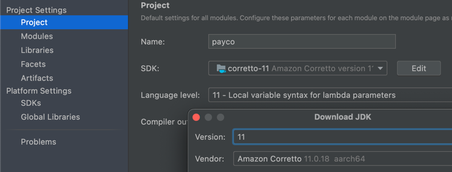

# 실행방법
```
1. mvn clean package
2. java –jar target/payco-1.0.0.jar
```

# 1. HTTP/1.1 의 Host 헤더를 해석하세요.
1. Host 파일을 아래와 같이 수정합니다.
```
127.0.0.1 www.server1.com
127.0.0.1 www.server2.com
```
2. 8080 port로 호출한다면 Host에 따라 아래와 같이 노출됩니다.
```
http://www.server1.com:8080 호출시 server1 문구 노출
```
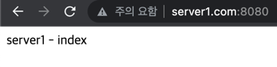
```
http://www.server2.com:8080 호출시 server2 문구 노출
```
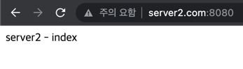

# 2. 설정 파일로 관리하세요.
```
file path: /src/main/resources/settings.json
아래와 같이 포트번호, 제한 확장자, 호스트별 디렉토리를 다르게 설정했습니다.
```
```
{
  "port": 8080,
  "restricted_extension": "exe",
  "server_list": [
    {
      "domain": "www.server1.com",
      "name": "was",
      "root": "/src/main/resources/server1",
      "index": "index.html",
      "403": "/403.html",
      "404": "/404.html",
      "500": "/500.html"
    },
    {
      "domain": "www.server2.com",
      "name": "was2",
      "root": "/src/main/resources/server2",
      "index": "index.html",
      "403": "/403.html",
      "404": "/404.html",
      "500": "/500.html"
    }
  ]
}
```

# 3. 403, 404, 500 오류를 처리합니다.
```
상태코드에 맞는 ForbiddenException, NotFoundException, InternalServerException 이 존재합니다.
각각의 Exception은 다중 catch문에서 처리가 됩니다.
```

# 4. 보안 규칙
```
.exe 확장자 접근시 아래와 같이 403 제한된 확장자 메세지가 노출됩니다.
```
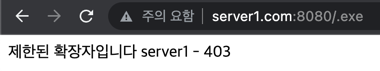
```
상위 폴더 접근시 아래와 같이 상위 디렉토리의 접근은 불가하다는 메세지가 노출됩니다. 
```
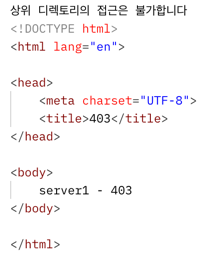

# 5. logback 프레임워크 http://logback.qos.ch/를 이용하여 다음의 로깅 작업을 합니다.
```
logback file path: /src/main/resources/logback.xml
log file path : ./logs
```
```
아래와 같이 로그 파일을 하루 단위로 분리했습니다.
```
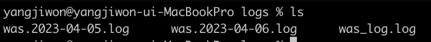
```
해당 로그 파일에서는 stackTrace 를 남기고 있습니다.
```
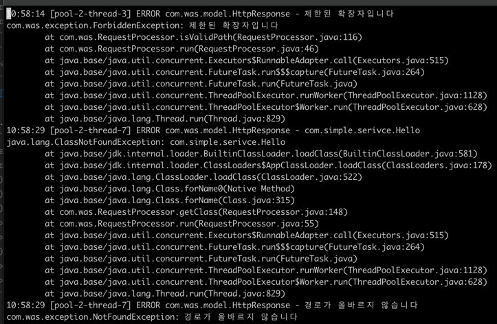

# 6. 간단한 WAS 를 구현합니다.
1. servlet 구현
```
http://www.server1.com:8080/Hello?name=jiwon 
호출시 com.simple.Hello.java와 매핑됩니다.
```
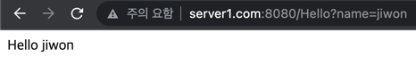
```
http://www.server1.com:8080/service.Hello?name=jiwon&name2=jiwon2
호출시 com.simple.service.Hello.java와 매핑됩니다.
```
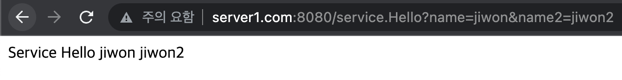

2. mapping.json 에 설정된 값은 아래와 같이 호출하여 확인 가능합니다.
```
mapping file path: /src/main/resources/mapping.json
```
```
http://www.server1.com:8080/Greeting?name=jiwon
호출시 mapping.json 파일 내 "/Greeting" : "Hello" 설정에 따라 Hello.java 파일에 매핑됩니다.
```
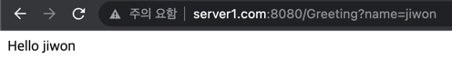
```
http://www.server1.com:8080/super.Greeting?name=jiwon&name2=jiwon2
호출시 mapping.json 파일 내 "/super.Greeting": "service.Hello" 설정에 따라 service.Hello.java 파일에 매핑됩니다.
```
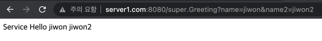

# 7. 현재 시각을 출력하는 SimpleServlet 구현체를 작성하세요.
```
아래와 같이 호출하여 확인 가능합니다.
http://www.server1.com:8080/Time
```
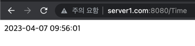

# 8. 앞에서 구현한 여러 스펙을 검증하는 테스트 케이스를 JUnit4 를 이용해서 작성하세요.
```
file path : /src/test/java/com/was/RequestProcessorTest
```
```
테스트 전 서버를 실행하고, 실제 호출을 진행하는 방식으로 테스트 코드를 구현하였습니다.
* 서버가 실행되지 않은 상태에서 실행 부탁드립니다.
```
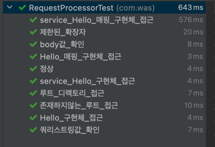

# 9. 참고사항
```
1. POST 메서드로 호출할 경우 body 값 파싱이 가능합니다.
```
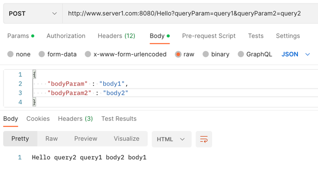
